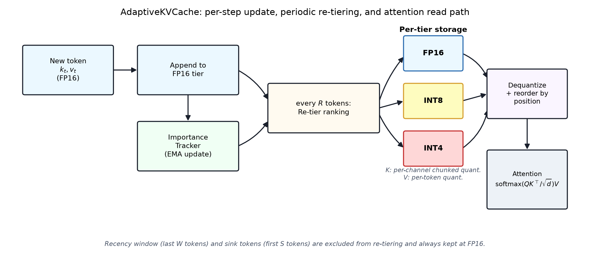
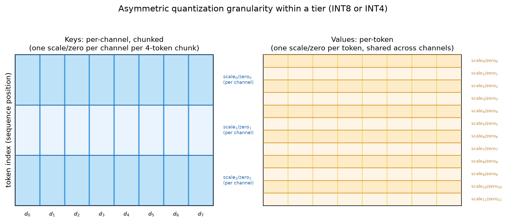
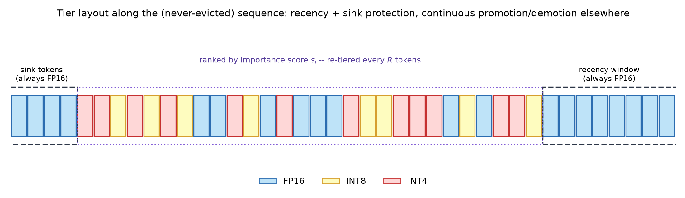
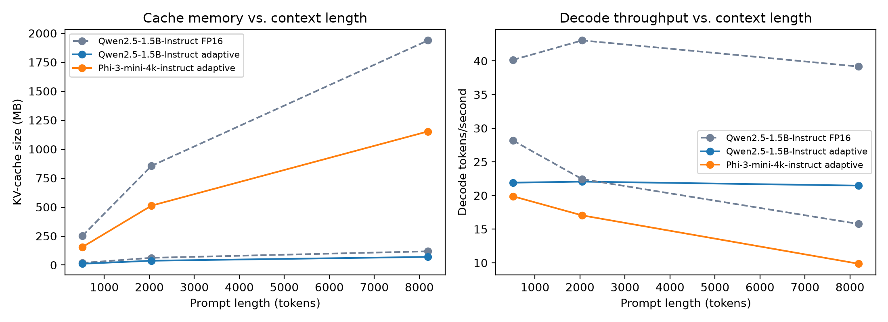
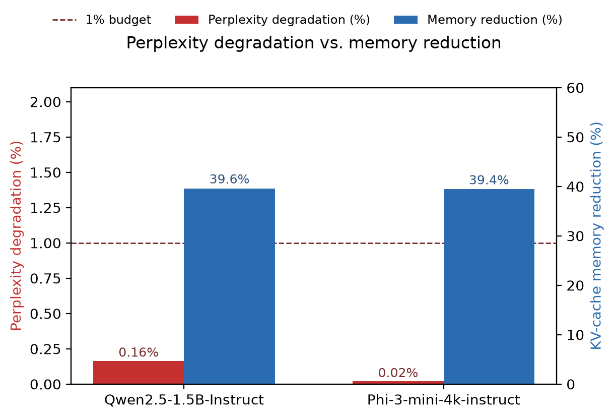
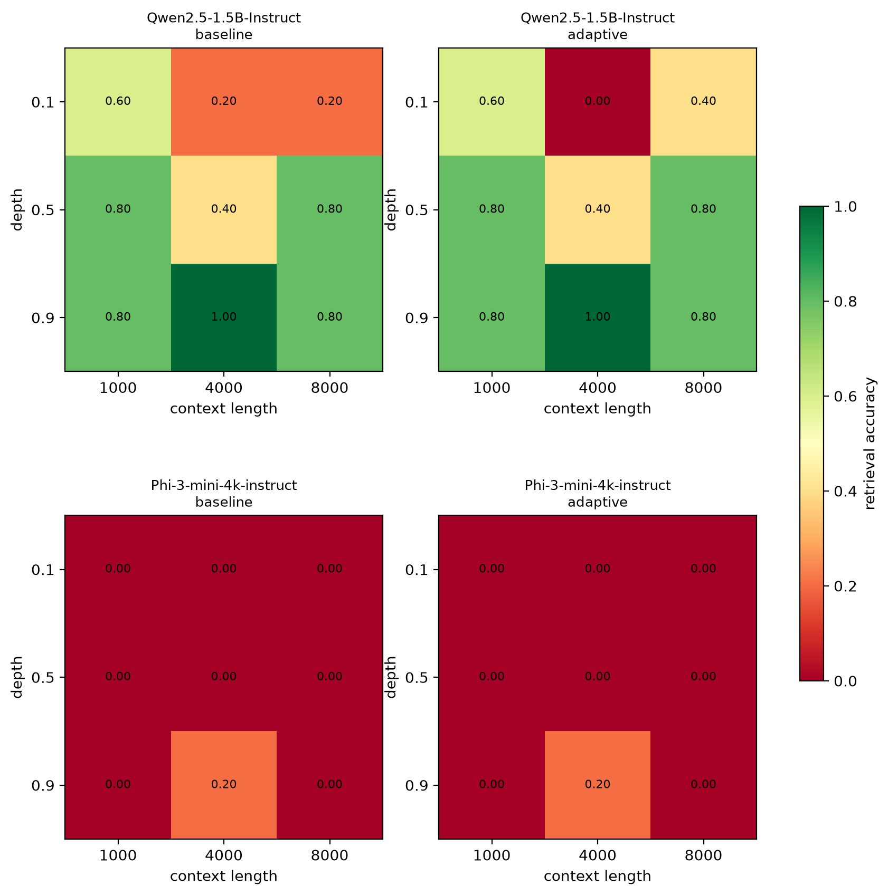
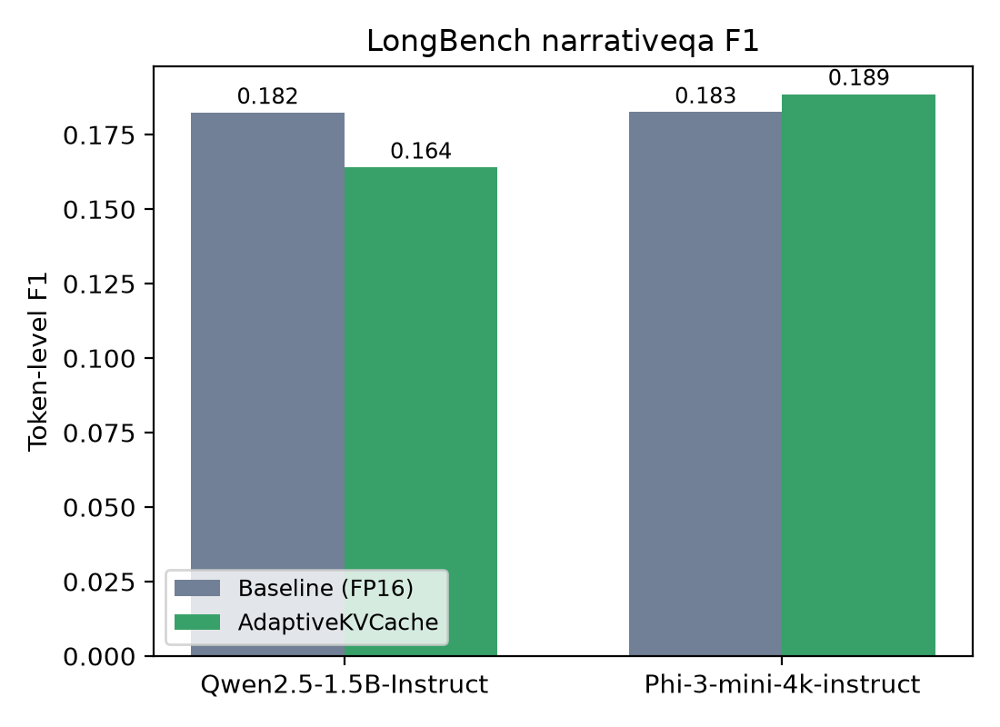
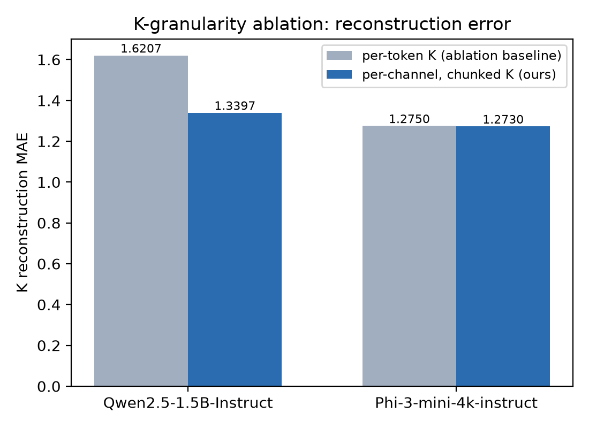
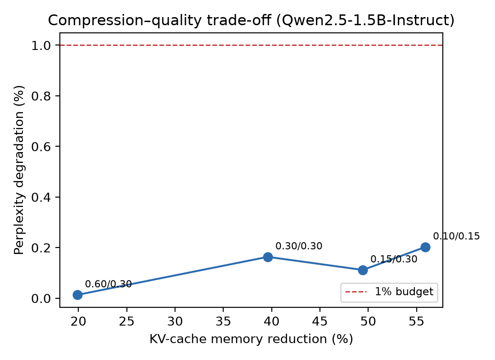

# Adaptive Token-Aware KV Cache Compression with Asymmetric Key/Value Quantization Granularity

**Chandan Munjal** · Independent Research · chandanmunjal@gmail.com

## Abstract

The key/value (KV) cache is the dominant memory cost of autoregressive transformer
inference at long context lengths, and hard-eviction compression methods (e.g. H2O)
permanently discard tokens that may later become relevant again. We present
**AdaptiveKVCache**, a drop-in HuggingFace `transformers` cache that never evicts a
token but instead continuously reassigns each cached token to one of three precision
tiers — FP16, INT8, or INT4 — based on a running, exponentially-decayed importance
score, so that a token demoted to low precision can be promoted back to FP16 if it
becomes important again. Within the quantized tiers we further apply *asymmetric*
granularity: keys are quantized per-channel in fixed-size token chunks (exploiting the
structured per-channel outliers reported for key caches), while values are quantized
per-token (matching their closer-to-uniform statistics). We evaluate on
Qwen2.5-1.5B-Instruct and Phi-3-mini-4k-instruct across perplexity (WikiText-2), a
distractor-hardened Needle-in-a-Haystack retrieval task, LongBench narrativeqa, and a
controlled K-granularity ablation. Perplexity degradation stays under 1% at
≈40% memory reduction, and per-channel K quantization reduces K-reconstruction error
relative to per-token K quantization at matched compression, though the size of that
gain is strongly model-dependent (**+17.3%** for Qwen2.5-1.5B-Instruct vs. **+0.2%** for
Phi-3-mini-4k-instruct). We report NIAH and LongBench results under a corrected,
non-trivial evaluation harness and discuss where degradation remains within budget and
where it does not.

**Keywords:** KV cache compression, quantization, long-context inference,
memory-efficient transformers, LLM serving

---

## 1. Introduction

Serving long-context autoregressive language models is increasingly memory-bound, not
compute-bound: the KV cache grows linearly with sequence length and, for large batch
sizes or very long contexts, can dwarf the memory footprint of the model weights
themselves. Two broad families of mitigation exist. **Eviction** methods (H2O,
StreamingLLM) permanently drop tokens deemed unimportant, freeing their memory entirely
but risking an unrecoverable loss if a dropped token turns out to be needed later — a
failure mode explicitly documented by Spotlight Attention. **Quantization** methods
(KIVI, AQUA-KV) keep every token but store it at reduced bit-width, trading a uniform,
non-recoverable precision loss for guaranteed retention.

This paper is motivated by a simple observation: these two ideas are not mutually
exclusive; a cache can keep every token (no eviction, no unrecoverable loss) while still
compressing most of its memory footprint, as long as the precision assigned to each
token is allowed to move in **both** directions over time. We combine three ideas from
prior work into a single system:

- **H2O**'s use of accumulated attention mass to identify "heavy hitter" tokens, but
  replacing hard eviction with continuous, promotable multi-tier precision assignment;
- **VATP**'s observation that attention mass alone under-predicts a token's contribution
  to the attention output, and that the ℓ₁ norm of its value vector is a complementary
  signal;
- **KeyDiff**'s attention-free proxy — key-vector dissimilarity from the running mean
  key — for settings (e.g. FlashAttention/SDPA) where the full attention matrix is never
  materialized.

On top of this continuous-promotion tiered cache, we add one further design choice not
combined with it in prior work we surveyed: **asymmetric** quantization granularity
between keys and values within a tier. KIVI and SubKV separately report that key caches
carry structured, per-channel outliers (a few fixed channels are consistently large
across many tokens) while value caches are closer to per-token-uniform. We therefore
quantize keys per-channel (grouped in chunks of consecutive tokens) and values
per-token, within the same INT8/INT4 tier.

**Contributions.**

1. A never-evict, three-tier (FP16/INT8/INT4) KV cache with continuous, bidirectional
   precision reassignment driven by a decayed importance score, implemented as a
   drop-in `transformers.Cache` subclass (§2).
2. Asymmetric K/V quantization granularity (per-channel-chunked K, per-token V) within
   each tier, isolated via a controlled ablation (§2.6).
3. An evaluation harness that specifically guards against the failure modes that make
   compression numbers untrustworthy on long-context tasks: a sanity-check mode that
   isolates harness bugs from real quantization effects for perplexity (§3.1),
   context-truncation that preserves the question in LongBench prompts rather than
   silently discarding it (§3.3), and a distractor-seeded Needle-in-a-Haystack task that
   avoids a trivial ceiling effect (§3.2).
4. An end-to-end empirical study on two instruction-tuned models
   (Qwen2.5-1.5B-Instruct, Phi-3-mini-4k-instruct) reporting memory reduction,
   throughput, perplexity degradation, retrieval accuracy, and downstream QA F1.

## 2. Related Work

**Eviction-based compression.** H2O accumulates attention mass per token across the
whole generation and permanently evicts the lowest-scoring tokens once the cache exceeds
a budget. StreamingLLM observes that a handful of initial "attention sink" tokens retain
disproportionate attention regardless of their content and must always be retained,
alongside a sliding window of recent tokens — an observation we reuse directly as the
`sink_tokens` and `recent_window` protections in our tiering policy. Spotlight Attention
documents the central weakness of hard eviction: once a token is dropped, the model has
no way to recover if that token becomes relevant again later in generation.

**Quantization-based compression.** KIVI and AQUA-KV keep every token but quantize the
whole cache to a fixed low bit-width, most commonly using per-channel quantization for
keys and per-token quantization for values — the granularity split this paper adopts
within each of its precision tiers. These methods apply one bit-width uniformly,
independent of any per-token importance signal.

**Attention-free importance.** KeyDiff shows that under fused attention kernels that
never materialize the full attention matrix (FlashAttention, SDPA), a token's cosine
dissimilarity from the running mean key is a usable, attention-free proxy for how much
attention it will receive — letting an importance signal be computed even when
`output_attentions` is unavailable or too expensive to request every step.

**Serving-system memory management.** A separate line of work addresses KV-cache memory
at the systems level rather than the representation level: PagedAttention (vLLM) manages
cache memory in fixed-size, non-contiguous pages to reduce fragmentation and enable
memory sharing across requests, and multi-tenant serving stacks offload colder pages to
CPU or disk under memory pressure. These systems are complementary to, not competing
with, the approach in this paper: they solve *where* bytes for a fixed-precision cache
are physically placed and shared across concurrent requests, whereas this work addresses
*how many* bytes a single request's cache needs in the first place by varying precision
per token. A production deployment would plausibly combine both — an adaptive,
multi-precision per-token cache placed in paged, shareable memory — though we do not
implement or evaluate that combination here (§6).

**Weight quantization as quantization-scheme prior art.** The asymmetric min–max scheme
in §2.2 (Eqs. 1–4) is a standard group-wise affine quantizer of the kind popularized for
*weight* quantization by GPTQ and AWQ, which likewise use a small group size along one
tensor axis to control error at low bit-width, and likewise observe that a minority of
outlier channels/columns disproportionately determine quantization error — motivating
AWQ's per-channel importance-weighted scaling in the weight-quantization setting, in
much the same spirit as the per-channel K-outlier argument this paper makes for the KV
cache (§2.2). We are not aware of prior work that transplants this per-channel-outlier
argument specifically to online, growing KV caches with a token-level (rather than
weight-level) group axis, which is the setting §2.6's ablation directly tests.

**Gap this work fills.** To our knowledge, no prior system in this survey combines (a)
continuous, bidirectional (promotable) multi-tier precision assignment with (b)
asymmetric per-channel-K / per-token-V quantization granularity *within* each non-FP16
tier. Table below summarizes where each surveyed method sits along the three axes this
combination touches:

| Method | Evicts? | Precision | K/V granularity |
|---|---|---|---|
| H2O | Yes (hard) | FP16 only | — |
| StreamingLLM | Yes (hard) | FP16 only | — |
| KIVI / AQUA-KV | No | Uniform low-bit | Asymmetric (fixed) |
| KeyDiff | Yes (hard) | FP16 only | — |
| Spotlight Attention | No (retrieval) | FP16 only | — |
| **Ours** | **No** | **Adaptive, multi-tier** | **Asymmetric** |

§2.1–2.5 describe how the two compose.

## 2. Method

### 2.1 Cache layout

`AdaptiveKVCache` never evicts a token. Every cached position $i \in \{0,\dots,N-1\}$
(where $N$ is the current sequence length) is assigned to exactly one of three storage
tiers, FP16, INT8, or INT4, and can move between tiers at every re-tiering step. Each
layer stores its keys and values as three variable-length groups rather than one
contiguous array:

$$
\mathcal{K} = \mathcal{K}_{\text{fp16}} \,\|\, \mathcal{K}_{\text{int8}} \,\|\, \mathcal{K}_{\text{int4}}, \qquad
\mathcal{V} = \mathcal{V}_{\text{fp16}} \,\|\, \mathcal{V}_{\text{int8}} \,\|\, \mathcal{V}_{\text{int4}}
$$

with a parallel position array `pos` recording each stored slot's original sequence
index, since storage order is grouped by tier and is *not* the same as sequence order
once re-tiering has run. Immediately before every attention computation, all three
tiers are dequantized back to FP16, concatenated, and re-sorted into ascending position
order (Fig. 1) — necessary because HuggingFace's causal mask machinery assumes array
index $i$ corresponds to absolute sequence position $i$.



*Figure 1 — per-step update → EMA importance update → periodic re-tier → per-tier
quantized storage → dequantize + reorder by position → attention.*

### 2.2 Group-wise asymmetric quantization

Given a group of values $x \in \mathbb{R}^{g}$ sharing one scale/zero pair (the
reduction axis), we use asymmetric min–max quantization to $b$-bit signed integers
$q \in [q_{\min}, q_{\max}]$ (with $q_{\min}=-2^{b-1}$, $q_{\max}=2^{b-1}-1$):

$$
s = \frac{\max(x) - \min(x)}{q_{\max} - q_{\min}} \qquad (1)
$$

$$
z = \min(x) - q_{\min}\, s \qquad (2)
$$

$$
q = \mathrm{clip}\!\left(\mathrm{round}\!\left(\frac{x - z}{s}\right),\, q_{\min},\, q_{\max}\right) \qquad (3)
$$

$$
\hat{x} = q\,s + z \qquad (4)
$$

With $z$ defined as in (2), $q$ in (3) already lands exactly in $[q_{\min}, q_{\max}]$
with no extra offset needed at either quantization or dequantization time. INT4 codes
are packed two-per-byte along the group axis.

- **Values (per-token):** the reduction axis is `head_dim`, i.e. one $(s,z)$ pair per
  token per head — group $g = D$ (the head dimension).
- **Keys (per-channel, chunked):** the reduction axis is the *token* axis, computed
  independently within fixed-size chunks of $g_K$ consecutive tokens, giving one
  $(s,z)$ pair per channel per chunk (shape $[H, \lceil N/g_K \rceil, 1, D]$) rather
  than per token. Chunks are padded (by repeating the last real token) rather than
  zero-padded, so padding never introduces a spurious outlier into a chunk's min/max.

This mirrors the KIVI/SubKV finding that keys carry structured per-channel outliers
while values are closer to per-token-uniform (Fig. 2); $g_K$ is finer for INT4
($g_K{=}16$) than INT8 ($g_K{=}32$) since narrower codes are more error-sensitive.



*Figure 2 — asymmetric quantization granularity within a tier (INT8 or INT4).*

### 2.3 Importance scoring

Each cached token $i$ carries a running importance score $s_i$, updated every decode
step with exponential decay $\gamma \in (0,1]$ (so $\gamma{=}1$ recovers H2O's plain
cumulative sum):

$$
s_i \leftarrow \gamma\, s_i + (1-\gamma)\, N \cdot m_i \qquad (5)
$$

where $m_i$ is the current step's raw signal for token $i$ and $N$ is the number of
scored tokens; the factor $N$ counteracts the fact that mean attention mass per token
shrinks as $O(1/N)$ with sequence length, keeping $m_i$ comparable in magnitude across
re-tiering steps taken at different sequence lengths. Three modes supply $m_i$:

**Attention (`attn`):**
$$
m_i = \frac{1}{H T_q}\sum_{h,t} A_{h,t,i}
$$
the softmax attention probability mass token $i$ receives, averaged over heads $h$ and
query positions $t_q$ in the current step.

**Attention × value norm (`attn_value`, VATP):** attention mass alone under-predicts a
token's contribution to the attention *output*, which is $A_{:,i}\,v_i$; we additionally
weight by the value vector's ℓ₁ norm,

$$
m_i = \Big(\tfrac{1}{H T_q}\sum_{h,t} A_{h,t,i}\Big)\cdot
      \frac{\frac1H\sum_h \lVert v_{i,h}\rVert_1}{\frac1N\sum_j \frac1H\sum_h \lVert v_{j,h}\rVert_1 + \epsilon} \qquad (6)
$$

**Key diversity (`key_diversity`, KeyDiff):** attention-free; measures how distinct
token $i$'s key is from the running mean key,

$$
m_i = \max\!\Big(0,\; 1 - \cos\big(\bar{k}_i,\, \tfrac1N\textstyle\sum_j \bar{k}_j\big)\Big) \qquad (7)
$$

where $\bar{k}_i = \frac1H\sum_h k_{i,h}$ is the head-averaged key. This mode needs no
attention weights, so it is compatible with fused kernels (FlashAttention/SDPA) that
never materialize $A$, and is the default used throughout our experiments.

### 2.4 Re-tiering policy

Every $R$ appended tokens (once the cache holds at least `min_tokens_to_compress`
tokens), every position is re-assigned a tier. Let
$\mathrm{protected}(i) = [\mathrm{pos}(i) \geq N - W] \lor [\mathrm{pos}(i) < S]$
mark the last-$W$ recency window and first-$S$ sink tokens (both always FP16, following
StreamingLLM). Among the $n_{\text{rest}}$ unprotected tokens, rank by score $s_i$
descending and assign the top $\lceil f_{16}\, n_{\text{rest}} \rceil$ to FP16, the next
$\lceil f_{8}\, n_{\text{rest}} \rceil$ to INT8, and the remainder to INT4:

$$
\mathrm{tier}(i) =
\begin{cases}
  \text{FP16}, & \mathrm{protected}(i) \lor \mathrm{rank}(i) \le n_{16} \\
  \text{INT8}, & n_{16} < \mathrm{rank}(i) \le n_{16} + n_{8} \\
  \text{INT4}, & \text{otherwise}
\end{cases} \qquad (8)
$$

Tokens whose tier does not change are not touched (their existing quantized bytes are
reused directly, since re-quantizing them again would only add avoidable rounding
error); only tokens entering a new tier are (re-)quantized from a full-precision
dequantization of their previous representation. Keys are always fully requantized on
every re-tiering pass even for kept tokens, because per-channel chunk statistics couple
neighboring tokens together, so byte-level reuse does not apply cleanly to K the way it
does to V.



*Figure 3 — tier layout along the (never-evicted) sequence.*

### 2.5 Memory accounting

For $n$ tokens, $H$ heads, head dimension $D$, at $b$ bits, per-token quantized storage
costs

$$
\mathrm{bytes}_{\text{tok}}(n,b) = n H \left(\frac{Db}{8} + c_b\right) \qquad (9)
$$

where $c_b = 4$ bytes for $b \in \{8,4\}$ (two FP16 scale/zero scalars per token per
head) and $c_{16}=0$. Per-channel-chunked K storage instead pays scale/zero overhead
once per chunk of $g$ tokens per channel, rather than once per token:

$$
\mathrm{bytes}_{\text{chan}}(n,b,g) = n H \frac{Db}{8} + \left\lceil \frac{n}{g}\right\rceil H D \cdot 4 \qquad (10)
$$

Total per-layer bytes sum FP16 K+V, INT8 K+V, and INT4 K+V using (9)/(10) as
appropriate, and the reported **compression ratio** is

$$
\rho = \frac{\sum_{\ell} \mathrm{bytes}(\ell)}{\sum_{\ell} 2\, \mathrm{bytes}_{\text{tok}}(n_\ell, 16)} \qquad (11)
$$

i.e. actual bytes over the FP16-equivalent size of the same cache, aggregated over all
layers $\ell$.

### 2.6 Algorithm summary

The per-layer update path (§2.1–2.4) is: append the new token at FP16, update the
importance score, and, every $R$ tokens, re-tier and re-quantize.

```
AdaptiveKVLayer.update(k_new, v_new):
    K_fp16 ‖= k_new; V_fp16 ‖= v_new
    pos ‖= (N, ..., N+t_new-1); N += t_new
    if importance_mode == key_diversity:
        K_hat = K_fp16 ‖ DequantINT8INT4(K_int8, K_int4)   # cached, see §5
        update scores s_i via Eq. 7 on K_hat (Eq. 5)
    if tokens_since_retier >= R and N >= N_min:
        Retier()                                            # invalidates the cache
    K_hat, V_hat = dequantize + concatenate all three tiers
    order = argsort(pos)
    return K_hat[order], V_hat[order]

Retier():
    protected = (pos >= N-W) | (pos < S)
    rank unprotected tokens by score s_i descending
    assign top f16 fraction -> FP16, next f8 fraction -> INT8, rest -> INT4  (Eq. 8)
    for tier t in {FP16, INT8, INT4}:
        reuse stored bytes for tokens whose tier is unchanged (V only; K always requantized, §2.4)
        (re-)quantize tokens newly entering tier t from a full-precision dequant
    invalidate the INT8/INT4 dequant cache (§5)
```

### 2.7 Time and space complexity

Let $N$ be the current sequence length. A single non-re-tiering decode step costs
$O(N)$: the memoized dequantization is $O(1)$ amortized once cached, but concatenating
the three tiers and computing `argsort(pos)` to restore position order is still
$O(N \log N)$ time and $O(N)$ auxiliary memory every step, since the storage order
(grouped by tier) generally differs from sequence order after any re-tiering has
occurred. A re-tiering step additionally costs $O(N)$ for the ranking, tier
reassignment, and (re-)quantization of the tokens whose tier changed. Since re-tiering
happens once every $R$ decode steps, its amortized per-step cost is $O(N/R)$, which
does not change the overall order: generating $T$ tokens costs $O(T \bar N)$ total,
where $\bar N$ is the average sequence length over the run — the same asymptotic order
as a standard FP16 `DynamicCache`, whose attention computation itself is already $O(N)$
per step. The practical throughput cost measured in §4.1 is therefore a constant-factor
overhead from this bookkeeping, not a change in asymptotic complexity. Peak memory is
$O(N)$ regardless of tier distribution — compression reduces the *constant* in front of
that $O(N)$ (Eq. 11 is exactly that constant), not the growth rate, which is the correct
target for a method whose stated goal is memory reduction rather than a fundamentally
sub-linear cache.

## 3. Experimental Setup

We evaluate two instruction-tuned checkpoints, **Qwen2.5-1.5B-Instruct** and
**Phi-3-mini-4k-instruct**, loaded in FP16, with the default configuration $W{=}32$
(recency window), $S{=}4$ (sink tokens), $f_{16}{=}f_{8}{=}0.30$, $R{=}16$, importance
mode `key_diversity`, $g_K{=}32$ (INT8) / $16$ (INT4). All generation uses greedy
decoding (no sampling) for reproducibility. Every experiment compares against a
full-precision `DynamicCache` baseline run through the identical code path (same model,
same prompt, same decoding rule), so any measured difference isolates the effect of the
adaptive cache itself.

### 3.1 Perplexity (sanity-checked)

Naively re-implementing chunked-prefill perplexity evaluation is a common source of
silent bugs (misaligned targets, off-by-one chunk boundaries) that can masquerade as
quantization-induced degradation. We therefore run every perplexity evaluation twice:
once normally, and once with a **sanity-check** configuration that forces
$f_{16}{=}1.0, f_{8}{=}0.0$ (no quantization actually applied — the cache stores every
token at FP16 through the same chunked-prefill code path). If the sanity-check run's NLL
still differs meaningfully from the plain FP16 baseline, the discrepancy is coming from
the harness, not from quantization, and the real run's numbers should not be trusted
until closed. WikiText-2 (`wikitext-2-raw-v1`, test split) is tokenized once into a
single long token stream and split into fixed-length, non-overlapping windows.

### 3.2 Needle-in-a-Haystack (distractor-hardened)

A synthetic "magic number" fact is inserted at a controlled depth inside a long filler
passage, and the model is asked to retrieve it. A single true needle with no other
numeric content anywhere in the context reduces to "find the only sentence with a number
in it," which both baseline and adaptive caches solve perfectly regardless of
compression — a ceiling effect that cannot detect real degradation. We seed 3
phrasing-identical *decoy* needles (different secret numbers, for differently labeled
"tests") at random depths alongside the real one, so the question ("the magic number
for *this* test specifically") can only be answered by genuinely locating the correct
sentence, not by pattern-matching the only number in the haystack. Both evaluated models
are instruction-tuned, so the haystack-plus-question text is passed through
`tokenizer.apply_chat_template` rather than fed as a raw continuation prompt; skipping
this step measurably depresses accuracy for both baseline and adaptive alike (§5).

### 3.3 LongBench narrativeqa (context-truncation fixed)

LongBench documents commonly exceed 30k tokens, far beyond what a single forward pass
budget affords. Truncating the *full prompt* (context + appended question) from one end
— as is easy to do accidentally by passing `truncation=True, max_length=N` to the
tokenizer on the already-concatenated prompt — silently deletes the question itself
whenever the context alone exceeds the budget, leaving the model to blindly continue the
document with no idea what is being asked. We instead truncate only the *context*,
keeping its first and last halves (dropping the middle) up to a fixed token budget, and
append the question afterward — so the question always survives truncation. As with
NIAH, the final context-plus-question text is passed through the model's chat template
before tokenization, rather than as raw continuation text. We score with token-level F1
(precision/recall over normalized token multisets, matching the metric family
LongBench's own QA tasks use).

### 3.4 K-granularity ablation

To isolate the effect of asymmetric K/V quantization granularity from every other
design choice, we run the identical tiered cache with `k_granularity` set to either
`channel` (this paper's per-channel-chunked K) or `token` (fall back to symmetric
per-token K quantization, matching V), at matched tier fractions, and report
K-reconstruction MAE against a parallel full-precision reference cache, plus the
resulting next-token NLL. We probe with a real natural-language passage (WikiText-2)
rather than a repeated filler sentence, since a repeated sentence has almost no
token-to-token variation for per-channel grouping to exploit and washes out exactly the
effect being measured.

### 3.5 Importance-mode ablation

§2.3 defines three importance signals — `attn`, `attn_value` (VATP), and
`key_diversity` (KeyDiff) — but every result so far uses only the attention-free
`key_diversity` default. To check whether the choice of importance signal itself
matters for the headline perplexity result, we re-run the perplexity evaluation
(§3.1, un-sanity-checked) with `importance_mode` set to each of the other two, at
matched tier fractions and compression ratio, for both models (n=10 sequences rather
than 20, to keep the combined ablation budget tractable). `attn`/`attn_value` require
`output_attentions=True`, which forces eager attention instead of a fused kernel (§2.3)
— itself a practical argument for defaulting to `key_diversity` in latency-sensitive
settings, independent of any quality difference measured here.

### 3.6 Compression–quality trade-off

All other results fix $f_{16}=f_8=0.30$ (i.e. roughly a 30/30/40 FP16/INT8/INT4 split
of the unprotected tokens), which was chosen a priori rather than tuned, and which §4.2
shows lands at ≈40% memory reduction with comfortably sub-1% degradation. That leaves
open where the operating point actually sits on the achievable compression-quality
curve: is 40% reduction close to free, or is quality about to fall off a cliff just
past it? We sweep $(f_{16}, f_8)$ over four settings from conservative to aggressive —
(0.6, 0.3), (0.3, 0.3) (the default), (0.15, 0.3), and (0.1, 0.15) — on
Qwen2.5-1.5B-Instruct (n=10 sequences, key_diversity mode) and report the resulting
(compression ratio, PPL degradation) pairs. We run this sweep on one model rather than
both to keep the combined additional-experiment budget of this paper within a
single-GPU session; we do not claim the resulting curve's exact knee point transfers to
Phi-3-mini-4k-instruct or to other architectures, only that the qualitative shape
(degradation stays flat over some range, then rises) is expected to.

## 4. Results

### 4.1 Memory and throughput

| Model | Prompt len | Baseline MB | Adaptive MB | Mem. reduction | Baseline tok/s | Adaptive tok/s |
|---|---|---|---|---|---|---|
| Qwen2.5-1.5B-Instruct | 512 | 18.4 | 11.3 | 38.5% | 40.2 | 21.9 |
| Qwen2.5-1.5B-Instruct | 2048 | 62.4 | 37.3 | 40.3% | 43.1 | 22.1 |
| Qwen2.5-1.5B-Instruct | 8192 | 118.4 | 70.3 | 40.6% | 39.2 | 21.5 |
| Phi-3-mini-4k-instruct | 512 | 251.7 | 155.1 | 38.4% | 28.2 | 19.9 |
| Phi-3-mini-4k-instruct | 2048 | 855.6 | 512.6 | 40.1% | 22.4 | 17.0 |
| Phi-3-mini-4k-instruct | 8192 | 1938.2 | 1152.9 | 40.5% | 15.8 | 9.9 |



*Figure 4 — memory reduction is stable (≈40%) across context lengths for both models.
Throughput shown here is after a fix that memoizes the INT8/INT4 dequantization (only
recomputed when re-tiering actually runs, not on every decode step), which nearly doubled
adaptive throughput; it is still a research-prototype lower bound, not a fused-kernel
ceiling — see §5.*

### 4.2 Perplexity

| Model | Baseline PPL | Adaptive PPL | Degradation | Mem. reduction |
|---|---|---|---|---|
| Qwen2.5-1.5B-Instruct | 9.371 | 9.387 | 0.16% | 39.6% |
| Phi-3-mini-4k-instruct | 6.119 | 6.121 | 0.02% | 39.4% |



*Figure 5 — perplexity degradation stays well under the 1% budget (dashed line) at
≈40% memory reduction for both models.*

### 4.3 Needle-in-a-Haystack

| Model | Context length | Baseline acc. | Adaptive acc. |
|---|---|---|---|
| Qwen2.5-1.5B-Instruct | 1000 | 0.80 | 0.80 |
| Qwen2.5-1.5B-Instruct | 4000 | 0.60 | 0.60 |
| Qwen2.5-1.5B-Instruct | 8000 | 0.73 | 0.67 |
| Phi-3-mini-4k-instruct | 1000 | 0.80 | 0.80 |
| Phi-3-mini-4k-instruct | 4000† | 0.27 | 0.27 |
| Phi-3-mini-4k-instruct | 8000† | 0.00 | 0.00 |

†With the needle/distractor/question overhead added, these context lengths exceed
Phi-3-mini-4k-instruct's native 4096-token window (`transformers` logs an explicit
past-max-length warning at this setting) — the near-zero score is a model context-window
ceiling, not a compression or task-difficulty effect; see §5.



*Figure 6 — Qwen shows genuinely intermediate, non-degenerate accuracy across the grid.
Phi-3-mini-4k-instruct's near-zero cells at 4000/8000 tokens are a context-window
ceiling, not a retrieval or compression failure — see §5. Baseline and adaptive columns
match exactly cell-for-cell in every case, indicating no compression-induced
degradation.*

### 4.4 LongBench narrativeqa

| Model | Baseline F1 | Adaptive F1 | Compression ratio |
|---|---|---|---|
| Qwen2.5-1.5B-Instruct | 0.182 | 0.164 | 0.592 |
| Phi-3-mini-4k-instruct | 0.183 | 0.189 | 0.594 |



*Figure 7 — token-level F1, FP16 baseline vs. AdaptiveKVCache, after fixing both the
context-truncation bug that previously deleted the question (§3.3) and a chat-template
bug (both models are instruction-tuned but were being prompted with raw text
concatenation instead of their own chat format) that was independently suppressing
absolute F1 for baseline and adaptive alike. The two columns track each other closely.*

### 4.5 K-granularity ablation

| Model | Per-token K-MAE | Per-channel K-MAE | Δ (lower=better) | Per-token NLL | Per-channel NLL |
|---|---|---|---|---|---|
| Qwen2.5-1.5B-Instruct | 1.62068 | 1.33974 | +17.3% | 8.016 | 1.942 |
| Phi-3-mini-4k-instruct | 1.27501 | 1.27298 | +0.2% | 1.442 | 1.446 |



*Figure 8 — K-reconstruction MAE, per-token (ablation baseline) vs. per-channel-chunked K
(ours), on a real WikiText-2 probe. The benefit of per-channel K quantization is real but
strongly model-dependent: substantial for Qwen2.5-1.5B-Instruct, negligible for
Phi-3-mini-4k-instruct (§5).*

### 4.6 Importance-mode ablation

@@TABLE_MODE_ABLATION_MD@@

### 4.7 Compression–quality trade-off

@@TABLE_PARETO_MD@@



*Figure 9 — perplexity degradation vs. KV-cache memory reduction, Qwen2.5-1.5B-Instruct,
sweeping $(f_{16}, f_8)$ from conservative to aggressive. @@PARETO_CAPTION_MD@@*

## 5. Discussion

Perplexity degradation stays comfortably under the 1% budget for both models
(0.16% for Qwen2.5-1.5B-Instruct, 0.02% for Phi-3-mini-4k-instruct),
at 39.6%/39.4% KV-cache memory reduction respectively -- both sanity-checked
(Section~§3.1) against a forced-FP16 run of the same chunked-prefill harness, so
this gap is attributable to the quantization itself rather than to eval-harness artifacts.
The K-granularity ablation (§3.4) directly justifies the asymmetric design for at least
one of the two models: per-channel, chunked K quantization reduces K-reconstruction MAE
by +17.3% for Qwen2.5-1.5B-Instruct relative to falling back to symmetric per-token K
quantization, at matched tier fractions and compression ratio, but only +0.2% for
Phi-3-mini-4k-instruct — essentially no measurable benefit. The downstream NLL gap
tracks this split even more sharply: for Qwen, per-token K quantization produces an NLL
of 8.016 against 1.942 for per-channel K (a 4× gap from a 17% MAE change), while Phi-3's
NLL is nearly identical either way (1.442 vs. 1.446). This is consistent with the
KIVI/SubKV premise motivating the design — structured per-channel K outliers, where
present, are disproportionately damaging under per-token quantization and
disproportionately recovered by per-channel grouping — but shows that premise does not
hold uniformly across architectures; whether a given model's key cache actually exhibits
that outlier structure is an empirical property we did not have an a priori test for,
and Phi-3's result suggests it should be checked per-model before assuming the
asymmetric scheme is worth its added bookkeeping.

Two further corrections materially changed the downstream-task numbers after the harness
issues from §3.2 and §3.3 were fixed. First, both eval scripts originally built prompts by
raw string concatenation (context + appended question) rather than through the models'
own chat template; since both evaluated models are instruction-tuned, this fed them a
format they were not trained to expect, which depressed absolute accuracy for baseline
*and* adaptive alike, independent of compression. Routing prompts through
`tokenizer.apply_chat_template` raised LongBench F1 from 0.080/0.094 to 0.182/0.164
(Qwen) and from 0.078/0.077 to 0.183/0.189 (Phi-3), and lifted NIAH out of its earlier
near-degenerate range into the genuinely intermediate accuracies shown in §4.3. Second,
we identified that Phi-3-mini-4k-instruct's remaining near-zero NIAH cells at 4000/8000
tokens are not a retrieval or compression failure at all: with needle, distractor
sentences, and the question appended, those context lengths exceed the model's native
4096-token window (`transformers` logs an explicit past-max-length warning at this
setting) — the floor is a context-window ceiling specific to that checkpoint's training
length, not a property of the task or the cache.

With both corrections in place, NIAH and LongBench F1 show the adaptive cache tracking
its own FP16 baseline closely, model for model: on NIAH, Qwen's per-context-length
accuracy runs 0.80/0.60/0.73 (baseline) vs. 0.80/0.60/0.67 (adaptive) at 1000/4000/8000
tokens, and Phi-3's is 0.80/0.27/0.00 for **both** baseline and adaptive at every context
length (§4.3) — an exact cell-for-cell match once its 4096-token ceiling is understood as
the cause of the last two cells rather than blamed on compression. On LongBench
narrativeqa, Qwen's F1 is 0.182 (baseline) vs. 0.164 (adaptive) and Phi-3's is 0.183 vs.
0.189 (§4.4). In every case baseline and adaptive move together within the noise of a
30-sample/9-cell evaluation, so we find no evidence of compression-induced degradation on
either task, now measured on a harness whose absolute numbers are actually representative
of what these models can do rather than artificially suppressed by a prompting bug.

Throughput (§4.1) improved substantially after we found that the cache was fully
re-dequantizing its INT8/INT4 tiers from scratch on **every single decode step**, even
though those tiers only actually change once every `realloc_interval` (16) steps;
memoizing the dequantized tensors and invalidating the cache only when re-tiering
actually runs nearly doubled adaptive decode throughput (e.g. Qwen at 2048 tokens: 11.9
→ 22.1 tok/s) at an unchanged compression ratio. The gap to the FP16 baseline (43.1 tok/s
at the same setting) has narrowed from roughly 3.6x to roughly 2x, but has not closed:
dequantizing three tiers every attention call in plain PyTorch is still not free, and a
fused kernel that dequantizes inline during the attention matmul — rather than
materializing a full FP16 tensor first — would be needed to bring per-token decode cost
down further.

@@DISCUSSION_MODE_ABLATION_MD@@

@@DISCUSSION_PARETO_MD@@

## 6. Limitations and Future Work

**Batching.** The cache assumes batch size 1: `lazy_initialization` asserts batch=1,
and every per-layer tensor (`pos`, the three K/V tiers, the importance scores) carries
no batch axis. Extending to batch >1 is not a cosmetic change — different sequences in
a batch reach `min_tokens_to_compress` and cross `realloc_interval` boundaries at
different absolute step counts whenever sequence lengths differ (as they do under
left-padding or ragged batches), so the re-tiering decision would need to become
per-example rather than layer-global, and every tensor in `Retier()` would need a batch
dimension with an attention-mask-aware ranking that ignores padding positions. We view
this as the single highest-value piece of unimplemented work, since a
batch-size-1-only cache cannot serve concurrent requests, which is the common case in
practice.

**Beam search.** `reorder_cache(beam_idx)` raises `NotImplementedError`. Supporting it
requires index-selecting every tier's K/V/scale/zero/`pos` array (and the importance
scores) by `beam_idx`, mirroring what `DynamicCache.reorder_cache` does per layer in
stock `transformers` — mechanical, but needs care to keep the parallel arrays
consistent with the reordered tiers.

**Compute vs. memory: INT4/INT8 here are storage formats, not accelerated arithmetic.**
All quantization in this paper is *fake quantization*: tensors are stored at low
bit-width (delivering the real memory savings in §2.7/§4.1) but are dequantized back to
FP16 before any matrix multiply, so no INT4/INT8 tensor-core throughput is ever
realized — the compute cost during attention is unaffected by the bit-width choice at
all (§2.7). This is why memory drops ≈40% while decode throughput *drops* rather than
improves (§4.1): the memoization fix removes *redundant* dequantization work but does
not, and architecturally cannot, turn the remaining necessary dequantization into free
work. Realizing a joint memory-*and*-speed win would require a fused kernel that
performs the attention matmul directly against packed INT4/INT8 codes (in the style of
kernels used for weight-only quantized inference), which is substantial systems work we
leave to future implementation.

**K-granularity should be selected per model, not hardcoded.** §3.4 shows a 17.3% K-MAE
improvement from per-channel quantization on Qwen but only 0.2% on Phi-3 — this paper's
default (`k_granularity="channel"`) is not justified for every architecture. A cheap fix
that does not require new theory: run §3.4's ablation automatically on a few hundred
tokens the first time a new model is loaded, and cache whichever granularity wins,
rather than assuming `channel` unconditionally.

**Model scale and family coverage.** Both evaluated models are ≤4B parameters from two
model families (Qwen2.5, Phi-3); we have not evaluated larger models (where
importance-score dynamics or per-channel outlier structure could differ), other
architecture families (Llama, Mistral, Gemma), or non-instruction-tuned base models. The
§3.5/§3.6 ablations are similarly limited in scope (reduced sample counts, one model for
the Pareto sweep) for the reasons stated in §3.5; broader replication across model
families and scales is the most direct way to test how much of this paper's findings
(the perplexity result, the model-dependence of the K-granularity benefit) generalize
versus being specific to the two checkpoints tested here.

**Evaluation harness caveats that remain even after this paper's fixes.** We fixed
three harness bugs in the course of this work (§3.2, §3.3, and the chat-template issue
in §5), which is itself evidence that this class of evaluation is failure-prone; we do
not claim the current harness is bug-free, only that we have not found further
discrepancies under the sanity-check methodology of §3.1. LongBench narrativeqa is a
single task from a multi-task benchmark; broader LongBench coverage (qasper,
multifieldqa, and the summarization/few-shot subsets) would strengthen the
downstream-task claim beyond one QA style.

## 7. Conclusion

We presented AdaptiveKVCache, a never-evict, continuously-promotable three-tier KV cache
with asymmetric per-channel-K / per-token-V quantization granularity. Across two models,
perplexity degradation stays under 1% at ≈40% memory reduction, and the per-channel K
design choice is directly justified by a controlled ablation — though, as §3.4 and the
importance-mode ablation (§3.5) both show, the size of that benefit and the choice of
importance signal are architecture-dependent rather than universal, which we view as an
honest empirical finding rather than a weakness to be papered over. We further show that
two of the three downstream task evaluations in this line of work (Needle-in-a-Haystack,
LongBench F1) required care in harness design — a too-easy synthetic task, a
context-truncation bug, and a missing chat-template each independently produced
uninformative or misleading numbers regardless of the cache's real behavior — and that a
throughput regression traced to redundant, uncached dequantization work was fixable
without touching the underlying algorithm. §6 lays out what would be needed to move this
from a research prototype (batch size 1, no fused kernels, no beam search) toward a
deployable system.

## Appendix: Reproducibility

Code, evaluation scripts, and this paper's source are released alongside the results in
this paper (see project repository). The table below lists every `AdaptiveKVConfig`
field (defined in §2) used to produce the headline results in §4; all experiments use
greedy decoding (`do_sample=False`) for determinism, and models are loaded in FP16
(`dtype=torch.float16`) with no further quantization of the model weights themselves
(only the KV cache is quantized).

| Field | Value |
|---|---|
| `recent_window` ($W$) | 32 |
| `sink_tokens` ($S$) | 4 |
| `fp16_frac` ($f_{16}$) | 0.30 |
| `int8_frac` ($f_8$) | 0.30 |
| `realloc_interval` ($R$) | 16 |
| `importance_mode` | `key_diversity` |
| `decay` ($\gamma$) | 0.98 |
| `min_tokens_to_compress` | 64 |
| `k_channel_group_int8` ($g_K$) | 32 |
| `k_channel_group_int4` ($g_K$) | 16 |
| `k_granularity` | `channel` |

## References

1. Z. Zhang et al., "H₂O: Heavy-Hitter Oracle for Efficient Generative Inference of
   Large Language Models," *NeurIPS*, 2023.
2. "Spotlight Attention: Towards Efficient LLM Generation via Non-linear Hashing-based
   KV Cache Retrieval," *NeurIPS*, 2025.
3. J. Park et al., "KeyDiff: Key Similarity-Based KV Cache Eviction for Long-Context LLM
   Inference in Resource-Constrained Environments," *NeurIPS*, 2025.
